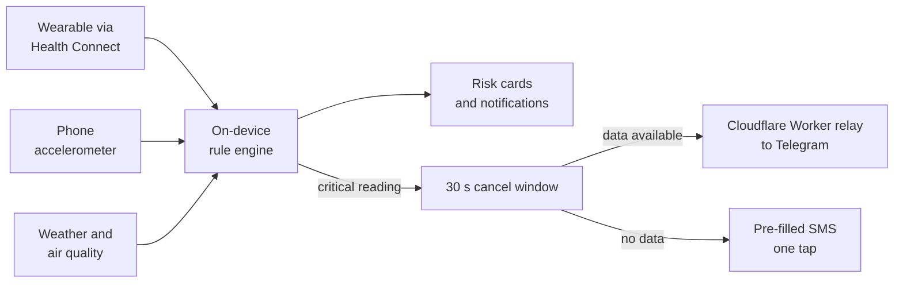

<div align="center">

# Raksha

**Offline AI health guardian for heat waves, floods and smog.**

Reads vitals on the phone, weighs them against local weather and air quality, and warns before it becomes an emergency. No account. No server. No vitals leave the device.


[Watch the demo](https://youtu.be/gu9cCQC_nqg) &middot; [Explore the 3D band](https://YOUR-USERNAME.github.io/YOUR-REPO/band-3d.html) &middot; [Project status](docs/PROJECT_STATUS.md) &middot; [Roadmap](docs/ROADMAP.md)

</div>

---

## Why Raksha

A fitness app tells you your heart rate. Raksha answers a harder question:

> **Is this heart rate, in this heat, a problem for this person right now?**

During a heat wave, 110 bpm on a cool morning and 110 bpm at a heat index of 40 °C mean very different things. Raksha combines both signals on the phone itself, so it keeps working when the network does not, which is exactly when disasters strike.

## Screenshots


<sub>Screenshots use simulated vitals for demonstration.</sub>

## Features

| | |
|---|---|
| **On-device risk scoring** | Six rule categories (heat stress using the NOAA heat index, respiratory, cardiovascular, falls, dehydration, fatigue). Each returns a level, a plain-language recommendation and a 0-100 score. Runs with no connectivity. |
| **Environmental context** | Live temperature, humidity and air quality for a coarse location. Cached, so the last known reading still informs the score offline. |
| **Disaster-relevant alerts** | Heat-index bands, an air-quality advisory that raises respiratory risk when AQI is unhealthy, and static flood and cyclone preparedness guidance. |
| **Emergency SOS** | A critical reading starts a 30-second cancel window, then sends vitals and a location link. Automatic over any data connection via a relay the team owns; a pre-filled SMS (one tap) when there is no data. |
| **Local history** | Readings stay on the phone for seven days and appear as 24-hour and 7-day trends. One control erases them. |
| **Privacy by design** | No account, no server, no analytics. Vitals never leave the device except in an SOS the user did not cancel. |

## How it works



## Raksha Band (planned wearable)

A low-cost wrist band that feeds Raksha directly, built around a XIAO ESP32-C3. The sensor-source picker already lists it; firmware and BLE code are not in this repository yet.


| Part | Role |
|---|---|
| XIAO ESP32-C3 | Microcontroller and BLE radio |
| MAX30101 | Heart rate |
| MAX30205 | Skin temperature |
| MPU6050 | Motion and fall detection |
| SHT40 | Ambient air temperature and humidity, under a vent on top |
| LiPo 3.7 V | Battery |
| Buzzer | Local alert |

Pod size is about 40 x 32 x 14 mm. Sensors sit on the skin side, the battery and controller in the middle, and the air sensor under a vent on top.

Open the [interactive 3D model](https://YOUR-USERNAME.github.io/YOUR-REPO/band-3d.html) to rotate, zoom and tap each part. The source is [`docs/band-3d.html`](docs/band-3d.html).

## Current status

Verified on one Android 15 device using an EAS development build. "Device validated" means it ran on that phone, not that it has been tested with real users over time.

**Done and device validated**

- Health Connect ingestion: permissions, heart rate and SpO₂ read into the risk engine
- Rule engine on live data: low SpO₂ raises the respiratory card; two critical samples escalate to the SOS countdown
- Air-quality advisory firing on real local AQI
- Local notifications on risk-level change, including the foreground-handler fix that made them appear at all
- SOS fallback: countdown expiry opens the SMS composer, pre-filled and addressed
- Emergency relay on Cloudflare Workers: a Telegram alert reached a real phone in about a second

**Code complete and tested in CI, not yet exercised on the phone**

- Persistent reading store (SQLite) and the trends screen that reads from it
- App-side relay dispatch and the in-app Telegram linking flow for an emergency contact
- User profile capture (age band, chronic condition, outdoor worker). It deliberately changes no threshold yet; that needs a methodology review first


## Roadmap

- [ ] Background sensing via a foreground service
- [ ] Raksha Band firmware and BLE adapter
- [ ] On-band fall detection
- [ ] Encrypted local storage with the key in the Android Keystore
- [ ] Caregiver role with push alerts
- [ ] Seven-day personal baselines with an explainable anomaly score
- [ ] Hindi interface

Full milestones are in [`docs/ROADMAP.md`](docs/ROADMAP.md).

## Tech stack

| Layer | Tools |
|---|---|
| App | Expo SDK 57, React Native 0.86, React 19, TypeScript 6, Expo Router |
| Health and sensors | `react-native-health-connect`, `expo-sensors` |
| Storage | `expo-sqlite`, AsyncStorage |
| Alerts and location | `expo-notifications`, `expo-location`, `expo-sms` |
| Emergency relay | Cloudflare Worker (TypeScript) in `relay/`, tested with Vitest |
| Testing | Jest, `jest-expo`, React Native Testing Library: **63 suites, 1457 tests** |
| CI | Type check, lint, both test suites and `expo-doctor` on every push |

## Getting started

**Requirements:** Node 22 and an Expo account for device builds.

**1. Install**

```bash
npm install
```

**2. Configure**

Create `.env.local` (git-ignored):

```bash
EXPO_PUBLIC_OPENWEATHER_API_KEY=your_key
EXPO_PUBLIC_SOS_RELAY_URL=https://your-worker.workers.dev/sos
```

The relay URL must end in `/sos`. Leaving it unset is supported: SOS then falls back to the SMS composer.

**3. Build and run**

Health Connect is a native module, so Expo Go cannot run this app. Build a development client once:

```bash
eas build --profile development --platform android
```

Install the resulting APK, then start the bundler:

```bash
npx expo start --dev-client
```

Add `--tunnel` if the phone and the development machine are not on the same network.

## Testing

```bash
npm test                       # app tests
npx tsc --noEmit               # type check
npx eslint src --max-warnings 0
cd relay && npm test           # relay tests
```

## Documentation

| Document | Contents |
|---|---|
| [`docs/PROJECT_STATUS.md`](docs/PROJECT_STATUS.md) | What is built, tested and validated, with blockers |
| [`docs/ROADMAP.md`](docs/ROADMAP.md) | Milestones |
| [`docs/features/`](docs/features/) | One document per feature, including the emergency relay contract |
| [`docs/decisions/`](docs/decisions/) | Architecture decision records |
| [`docs/validation/device-validation-plan.md`](docs/validation/device-validation-plan.md) | On-device test protocol and results |

## Disclaimer

Raksha is a research prototype. It is not a medical device and does not diagnose, treat or prevent any condition. In an emergency, call your local emergency number.
